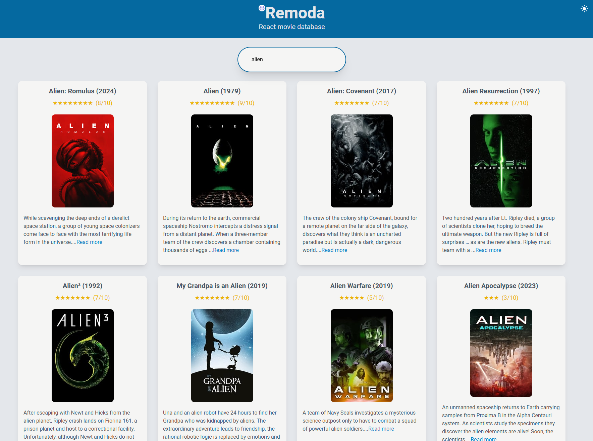

# Remoda (React Movie Database)

Web app for searching movies, featuring active search and infinite scrolling. 

Frontend: ``Vite + React``\
Backend: ``.NET``

Try the live demo at [remoda.azurewebsites.net](https://remoda.azurewebsites.net/).

*****

# Local development

This app uses a third party API for movie data. To be able to fetch movie data when running this app locally, you need an account in [The Movie Database](https://www.themoviedb.org/) (read more here https://developer.themoviedb.org/reference/intro/getting-started). 

Once you have an account and an access token, set the access token in the API project's ``appsettings.json`` file or in [user secrets](https://learn.microsoft.com/en-us/aspnet/core/security/app-secrets?view=aspnetcore-8.0&tabs=windows#set-a-secret) with key ``MovieDatabase:ApiAccessToken`` (preferred method).

### How to run locally

1) Run the frontend from ``\src\Frontend`` with command:
*npm run dev*

2) Run the backend API from ``\src\Backend\Api`` with command:
*dotnet run*

3) Browse to ``http://localhost:5001``

